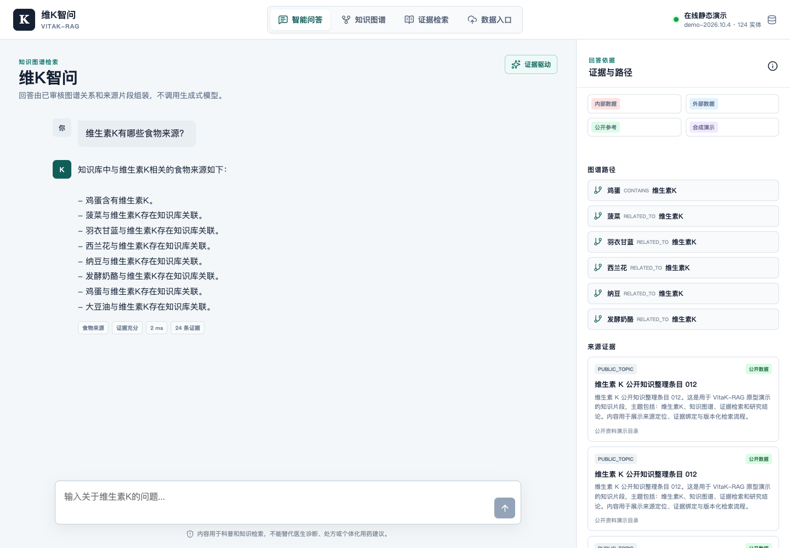

# 维K智问 VitaK-RAG

VitaK-RAG 是一个面向公众科普的维生素 K 知识图谱问答原型。系统使用 FastAPI、React、Kuzu、Chroma 和 SQLite，问答运行时**不调用生成式大模型**。回答由经过版本化管理的实体关系、证据路径和来源片段确定性组装。

当前演示库采用“公开可核验事实 + 明确标记的合成 RCT 样例”，尚未导入毕业设计真实数据库、内部 RCT 统计结果和完整文献集。

## 在线演示

GitHub Pages 版本会把演示快照导出到浏览器，直接运行同一套确定性问答、图谱浏览和证据检索逻辑，无需安装环境：

<https://zhujinjiang0-blip.github.io/vitak-rag/>

在线演示不包含 FastAPI 文件入库和内部审核接口；这些能力仍通过仓库中的完整后端在本地运行。



## 已实现能力

- 六领域维生素 K 属性图：生理代谢、食物营养、药物相互作用、临床疾病、检测评估、指南与 RCT。
- 124 个演示实体、438 条带证据关系、40 个来源、120 个知识片段和 80 道评测问题。
- 实体别名链接、规则意图识别、白名单图查询、1-2 跳路径检索和模板化回答。
- 每条回答均绑定来源片段；证据不足时明确拒答，不使用模型补写。
- 药物剂量、停药、诊断和紧急症状规则优先于普通知识检索。
- React 三页应用：智能问答、知识图谱和证据检索。
- 文档入库、审核队列、版本快照、索引重建和三方案评测命令行。
- 匿名临时会话、SSE 流式事件、localhost 内部 API 和本地离线演示数据。

## 技术结构

```text
backend/                 FastAPI、图谱查询、RAG 检索、数据管道和评测
frontend/                React + TypeScript + Vite 三页应用
data/snapshots/          版本化运行快照，首次启动自动生成
data/eval/               评测题集与报告
scripts/
  bootstrap.sh           安装依赖并生成演示快照
  dev.sh                 同时启动前后端
  visual-check.mjs       浏览器交互、截图和布局检查
```

后端使用 Kuzu 存储属性图，Chroma 存储向量，SQLite FTS5 + Jieba 提供中文关键词检索。元数据和审核状态保存在同一快照的 SQLite 文件中。

来源证据同时记录以下分类字段：

- `data_origin`：`internal`、`external`、`public` 或 `synthetic`。
- `data_owner`：资料所属团队、机构或公开来源方。
- `access_scope`：`private`、`controlled` 或 `public`。
- `source_classification`：`internal_rct`、`internal_database`、`guideline`、`review` 等细分类。

内部导入默认标记为 `internal/private`，公开资料标记为 `public`，合成 RCT 标记为 `synthetic`。这些字段会随 Citation 一并返回并展示在证据卡片中。

项目真实数据按以下来源组织：

- 外部数据：564 篇已发表维生素 K 研究文献，经抽取和对齐形成 13,118 条三元组、6,297 个唯一实体，统一标记为 `external/public`。
- 内部数据：项目组 395 人前瞻性干预队列，使用标准化个体证据和强度标签，统一标记为 `internal/private`。

完整字段和导入说明见 [`docs/data-sources.md`](docs/data-sources.md)。

## 本地启动

当前开发环境已经安装依赖并生成演示快照，可以直接启动：

```bash
make api
make web
```

浏览器访问 `http://127.0.0.1:5173`，API 文档位于 `http://127.0.0.1:8000/docs`。

本地数据入口位于 `http://127.0.0.1:5173/#/import`：

- “外部数据”入口用于上传 `aligned_triples.csv`，并直接生成外部文献三元组。
- “内部数据”入口用于上传内部 CSV，默认以 `internal/private` 证据入库并进入审核流程。
- GitHub Pages 在线版是只读演示，文件上传必须在本地全栈模式运行。

也可以在一个终端启动前后端：

```bash
./scripts/dev.sh
```

此环境原先没有 Node、Python 3.12 或 Docker。脚本默认使用 Codex 随附运行时；在其他机器上可通过 `PYTHON_BIN`、`PNPM_BIN` 指定本机路径。

完整重新安装：

```bash
./scripts/bootstrap.sh
```

## 常用命令

```bash
cd backend

# 创建或恢复演示快照
../.venv/bin/python -m app.cli seed-demo

# 查看、校验、激活和回滚快照
../.venv/bin/python -m app.cli snapshot-list
../.venv/bin/python -m app.cli snapshot-validate demo-2026.10.4
../.venv/bin/python -m app.cli snapshot-activate demo-2026.10.4

# 导入外部文献 aligned_triples.csv
../.venv/bin/python -m app.cli import-external-triples path/to/aligned_triples.csv

# 导入文本型 PDF、DOCX、TXT、Markdown、JSON、XML、HTML、CSV 或 XLSX
../.venv/bin/python -m app.cli ingest path/to/document.pdf --title "材料名称"

# 使用云模型产生候选关系，但不会直接写入图谱
../.venv/bin/python -m app.cli ingest path/to/document.pdf --use-llm

# 导出并审核候选关系
../.venv/bin/python -m app.cli review-export
../.venv/bin/python -m app.cli review-apply --decision approve --ids CANDIDATE_ID

# 重建当前版本的向量索引
../.venv/bin/python -m app.cli rebuild-index

# 生成 80 道题并运行评测
../.venv/bin/python -m app.cli generate-eval
../.venv/bin/python -m app.cli evaluate
```

Kuzu 使用文件锁。运行 CLI 时若 API 正在访问同一快照，可能提示无法加锁。此时应使用内部 API 完成导入，或先停止 API 再运行 CLI。

## 问答处理流程

1. 规范化问题并匹配实体名称、ID 和别名。
2. 通过确定性规则识别食物来源、相互作用、缺乏风险、检测指标等意图。
3. 从 Kuzu 查询白名单关系，最多扩展两跳路径。
4. 从 SQLite FTS5 和 Chroma 召回来源片段。
5. 根据来源、证据等级、抽取置信度和路径长度组装回答。
6. 如果证据不足，返回拒答和相关实体，不生成未经知识库支持的内容。

公共接口：

- `POST /api/v1/qa/query`
- `POST /api/v1/qa/stream`
- `GET /api/v1/search?q=...`
- `GET /api/v1/evidence/{id}`
- `GET /api/v1/graph/search?q=...`
- `POST /api/v1/graph/subgraph`
- `GET /api/v1/health`

内部接口位于 `/internal/v1/*`，要求 `X-Internal-Token`，并且只接受 localhost 请求。

## 入库与审核

入库会从当前快照复制出新的版本目录，解析文档、切分片段、建立来源证据并产生候选关系。内部导入默认使用 `data_origin=internal`、`access_scope=private`，可通过 CLI 参数覆盖。候选关系进入 SQLite 审核队列，只有执行 `review-apply --decision approve` 后才写入图谱。

默认抽取服务为阿里云百炼 Qwen，可通过 `.env` 切换任意 OpenAI 兼容接口。生成模型只允许用于离线结构化抽取，不能参与用户问答的最终回答。

扫描件首版只给出“待 OCR”警告，不会把空文本当作成功解析。

## 评测结果

当前演示快照上运行 80 道分层问题的结果位于 `data/eval/report.json`：

| 方法 | Recall@5 | MRR@10 | nDCG@10 | 路径命中率 | P95 |
| --- | ---: | ---: | ---: | ---: | ---: |
| 纯向量检索 | 0.016 | 0.028 | 0.018 | 0.000 | 6.5 ms |
| 纯图谱检索 | 0.762 | 0.734 | 0.764 | 0.813 | 24.7 ms |
| KG混合检索 | 0.887 | 0.859 | 0.889 | 0.938 | 30.4 ms |

无证据问题拒答准确率为 1.0。演示数据上的结果只能证明管线可运行，不能替代真实毕业设计数据上的最终实验结论。

## 测试与界面验收

```bash
make test
make lint
make build
node scripts/visual-check.mjs
```

浏览器验收覆盖桌面问答、图谱、证据检索和移动端布局，并检查控制台错误、横向溢出和截图非空。

## 当前边界

- 无用户注册、公开上传、数据管理后台、公网部署和 HTTPS。
- 无扫描件 OCR 和复杂 PDF 版面还原。
- 演示来源与合成 RCT 不可用于临床决策。
- 所有内容仅用于知识检索和科普演示，不能替代医生诊断、处方或个体化用药建议。
